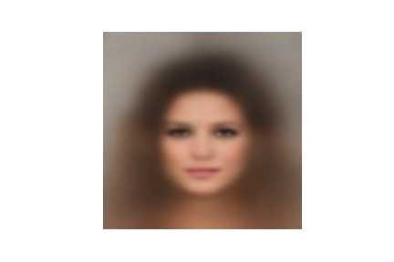
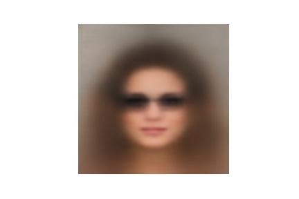
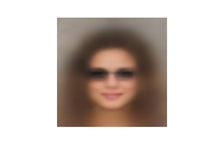

# forensic-image-generation
## Generate an Image of a young and attractive female using the following command:
```
python inference.py --attributes 'brown_hair heavy_makeup attractive no_beard young' \
                    --encoder saved_models/vae.pth --generator saved_models/generator.pth \
                    --device cpu
```
An Image will be generated and saved in the generated-imgs directory which is given below.


## Generate an Image of a young and attractive female with eyeglasses using the following command:
```
python inference.py --attributes 'brown_hair heavy_makeup attractive no_beard young eyeglasses' \
                    --encoder saved_models/vae.pth --generator saved_models/generator.pth \
                    --device cpu
```
An Image will be generated and saved in the generated-imgs directory which is given below.


## Generate an Image of a smiling young and attractive female with eyeglasses using the following command:
```
python inference.py --attributes 'brown_hair heavy_makeup attractive no_beard young eyeglasses smiling' \
                    --encoder saved_models/vae.pth --generator saved_models/generator.pth \
                    --device cpu
```
An Image will be generated and saved in the generated-imgs directory which is given below.



